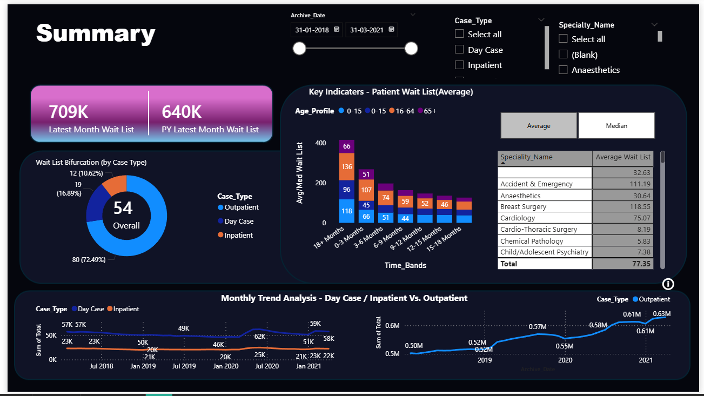

# Hi there, I'm Sneha! 👋

## 📊 About Me
Having recently graduated from Adhiyamaan Arts and Science College for Women, I am thrilled to officially launch my career in data analytics. During my studies, I discovered a genuine passion for data storytelling—learning how to take raw, complex datasets and turn them into clear, actionable business stories. I have spent the last few months deeply hands-on with SQL for data manipulation and Power BI for creating high-impact, interactive dashboards. As a fresh graduate, I bring up-to-date technical training, a strong eye for UI design, and an eager mindset ready to add value to a data-driven team.

* 🔭 **Current Focus:** Mastering advanced DAX formulas, interactive data modeling, and performance tuning.
* 💬 **Ask me about:** SQL pattern matching, Power BI chart data mapping, building star-schema relationships, python and python libraries.
* 📫 **Connect with me:** [LinkedIn](https://www.linkedin.com/in/sneha-k-5a60b03b9/) | [Email](mailto:snehalavanya11@gmail.com)

---

## 🛠️ Tech Stack & Tools

---

## 🚀 Featured Projects

### 🏥 [Patient Healthcare & Waiting List Analysis Dashboard](https://github.com/snehalavanya11-stack)

* **What it does:** Developed an interactive healthcare dashboard in Power BI designed to analyze patient waiting lists, tracking key metrics across specialty departments, age profiles, and time bands to improve hospital operational efficiency.
* **Tools & Concepts Used:** Power BI (Power Query, DAX modeling), Advanced Chart Configurations, Data Mapping, and Multi-page Report Navigation.

#### 📈 Key Visuals & Analysis Tracked:
* **High-Level KPI Cards:** Engineered calculations to capture the **Latest Month Wait List (709K)** alongside **Prior Year (PY) Latest Month metrics (640K)** to monitor historical growth trends.
* **Wait List Bifurcation (Donut Chart):** Modeled operational shares showing that **Inpatient** requests comprise the largest volume (**72.49%**), followed by Outpatient and Day Case options.
* **Key Indicators & Time Bands (Stacked Column & Matrix):** Created dynamic filters enabling users to toggle metrics between **Average** and **Median** wait times. Visualized case backlogs across explicit time boundaries (0-3 Months up to 18+ Months) segmented by patient age profiles.
* **Monthly Trend Analysis:** Implemented dual line charts to compare historical caseload volume over a multi-year archive (2018–2021), isolating case type behaviors and structural shifts.

#### 🛠️ Technical Implementation Highlights:
* Successfully handled data mapping configurations within charts by pre-aligning waitlist values to unlock custom color-coded properties.
* Handled multi-dimensional field controls (Case Type, Archive Date, and Specialty Name) across disparate tables to establish seamless cross-filtering and interactive reporting.
* Designed a modern UI with a clean dark mode theme prioritizing readability, clear alignments, and optimal whitespace.

### 🔍 [Project 2: Fake Job Posting Detection Using Python & NLP](https://github.com/snehalavanya11-stack)
* **What it does:** Developed a supervised Machine Learning pipeline to automatically analyze job advertisements and accurately classify them as either genuine or fraudulent to protect online job seekers.
* **Tools & Libraries Used:** Python (Pandas, NumPy), Scikit-Learn (Naive Bayes, Logistic Regression), NLTK (Natural Language Processing), Matplotlib & Seaborn.
* **Dataset:** Modeled using the Employment Scam Aegean Dataset (EMSCAD / Kaggle Fake Job Postings dataset) containing roughly 18,000 unique records.

#### 📈 Machine Learning & NLP Workflow:
* **Exploratory Data Analysis (EDA):** Discovered that the dataset is highly imbalanced, with fraudulent postings comprising roughly 5% of total entries. Handled character-count distributions and highlighted that fake postings often lack verified company profiles or professional logos.
* **Text Preprocessing:** Cleaned unstructured text data (job descriptions and requirements) by applying lowercasing, tokenization, stop-word removal, and word lemmatization.
* **Feature Extraction:** Converted raw text components into structured numerical vectors using **TF-IDF (Term Frequency-Inverse Document Frequency)** to assign statistical weights to unique scam indicators.
* **Model Training & Evaluation:** Trained a Multinomial Naive Bayes baseline model optimized for sparse textual features, evaluating success using Classification Accuracy, Precision, and Recall scores.

#### 🛠️ Technical Implementation Highlights:
* Handled highly skewed classification target distributions through stratified test/train splits.
* Implemented text parsing steps using Python's NLTK toolkit to transform raw strings into actionable ML variables.
* Wrote clean, well-commented Python scripts inside Jupyter Notebook structures for reproducible data analytics pipelines.

---

